<div align="center">

  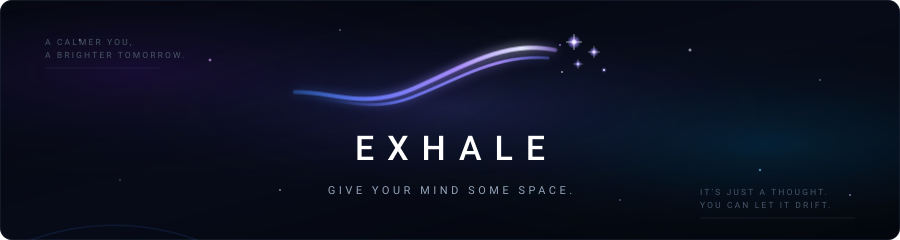

  <br/><br/>

  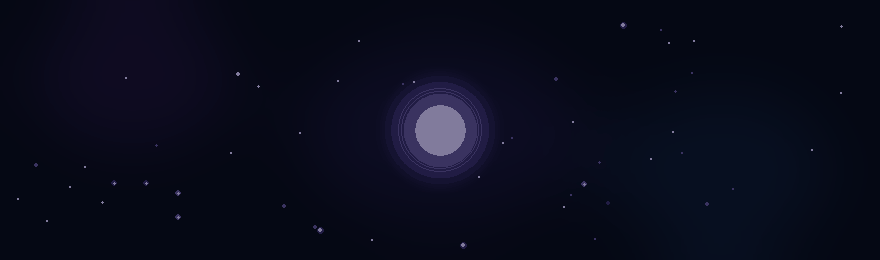

  <br/><br/>

  <h3>Give your mind some space.</h3>

  <p align="center">
    A minimalist cosmic experience that creates distance from overwhelming thoughts<br/>
    through reflective writing, guided breathing, and deep-space perspective shift.
  </p>

  <p align="center">
    <a href="https://exhale-cosmic.netlify.app">
      
    </a>
    <a href="#-architecture-overview">
      
    </a>
    <a href="#-the-experience">
      
    </a>
  </p>

  <p align="center">
    
    
    
    
    
    
    
    
  </p>

  <br/>

  <p align="center">
    <a href="https://exhale-cosmic.netlify.app"><strong>Launch Web App</strong></a> •
    <a href="#-about-exhale">About</a> •
    <a href="#-the-experience">The Journey</a> •
    <a href="#-experience-preview">Gallery</a> •
    <a href="#-system-architecture">Architecture</a> •
    <a href="#-getting-started">Getting Started</a>
  </p>

</div>

---

## 🌌 About EXHALE

**EXHALE** is a short, immersive mindfulness experience designed to help you create healthy psychological distance from heavy or intrusive thoughts. 

Instead of trying to suppress, fix, or analyze what is on your mind, EXHALE provides a quiet digital sanctuary where you can write down a single thought, settle into a guided breathing rhythm, and watch your thought gradually pull back into a vast, procedural starfield.

> ### The Core Insight
> 
> *"The thought did not disappear.  
> The space around it got bigger."*

### What EXHALE Is & Is Not

- **Intentional Negative Space:** Generous cosmic stillness without clutter, dashboards, or gamified progress bars.
- **Pure Ephemeral Privacy:** Thoughts are held strictly in temporary client memory and are never saved to local storage, indexed in databases, or sent across any network.
- **Spatial Shift over Solutions:** Rather than offering positive affirmations or advice, EXHALE alters the visual relationship between you and your thought.
- **Non-Clinical Design:** EXHALE is a reflective mindfulness tool. It does not make medical or therapeutic claims and is not a substitute for professional mental health support.

---

## 🪐 The Experience

The EXHALE journey unfolds as a continuous 6-stage choreographed sequence. Each stage transitions seamlessly into the next, guided by organic mathematical easing curves and ambient audio cues.

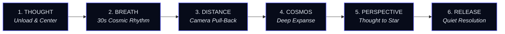

### The 6-Stage Choreography

| Stage | Name | Choreography & Behavior | Duration |
|:---:|:---|:---|:---:|
| **01** | **Thought Unloading** | User types an active thought or worry into a focused, distraction-free input. Once submitted, the thought becomes the primary visual anchor in the cosmos. | Self-paced |
| **02** | **Guided Breathing** | The thought settles into the center of the viewport as guided breathing begins. A two-cycle rhythm (4s Inhale, 2s Hold, 6s Exhale, 2s Rest) runs with soft pulsating light rings. | ~30s |
| **03** | **Continuous Camera Drift** | The breathing phase settles into a quiet pause. A cinematic 8.5-second camera pull-back begins, smoothly pushing the thought back in 3D spatial depth. | 8.5s |
| **04** | **Cosmic Expanse Reveal** | As the thought scales down, the canvas procedural starfield dynamically expands—revealing hundreds of previously hidden deep background stars. | Continuous |
| **05** | **Star Transformation** | The thought condenses across cosmic distance into a single, delicate starlight point, joining the wider universe as an equal element. | 2.0s hold |
| **06** | **Perspective & Release** | In total cosmic stillness, gentle perspective reflections appear sequentially (*"It still exists. It just isn't everything."* followed by *"A little more space."*), offering a quiet return home. | Settle |

---

## 📸 Experience Preview

The following captures depict the actual end-to-end journey in the EXHALE application across mobile and desktop environments:

### Mobile Experience Journey

<div align="center">
  <table>
    <tr>
      <td width="33%" align="center">
        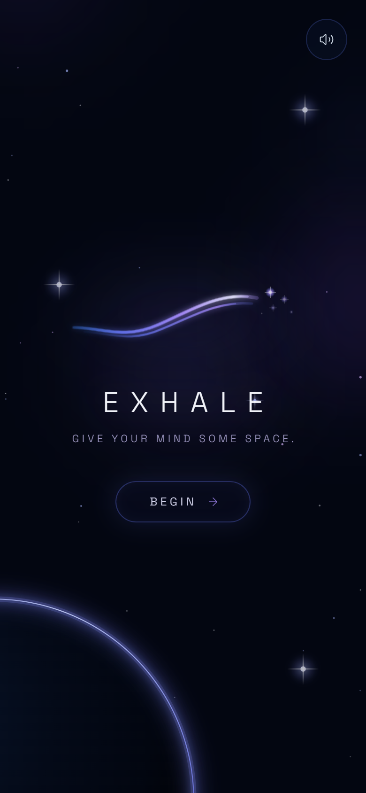<br/>
        <sub><b>01 · Home Portal</b><br/>Minimalist cosmic entry</sub>
      </td>
      <td width="33%" align="center">
        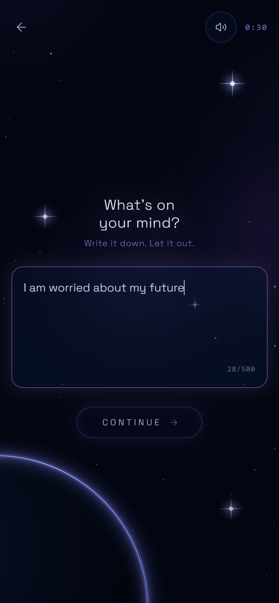<br/>
        <sub><b>02 · Thought Input</b><br/>Distraction-free unloading</sub>
      </td>
      <td width="33%" align="center">
        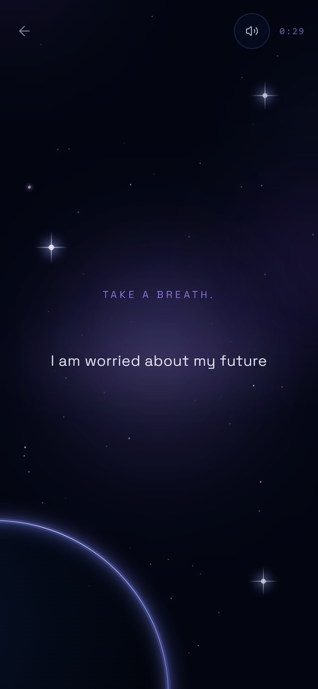<br/>
        <sub><b>03 · Guided Breathing</b><br/>Organic 4-2-6-2 sine cadence</sub>
      </td>
    </tr>
    <tr>
      <td width="33%" align="center">
        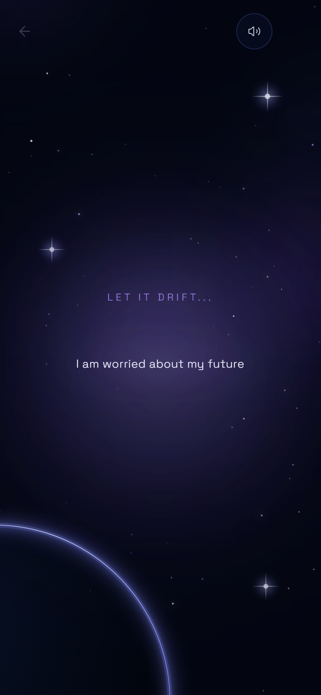<br/>
        <sub><b>04 · Cosmic Drift</b><br/>Spatial camera pull-back</sub>
      </td>
      <td width="33%" align="center">
        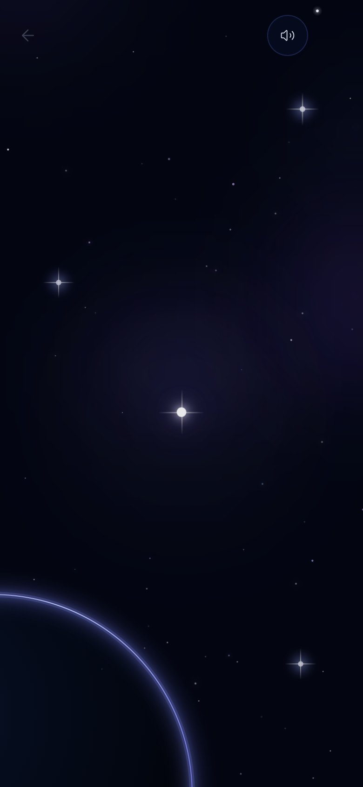<br/>
        <sub><b>05 · Star Alone</b><br/>Thought dissolves into starlight</sub>
      </td>
      <td width="33%" align="center">
        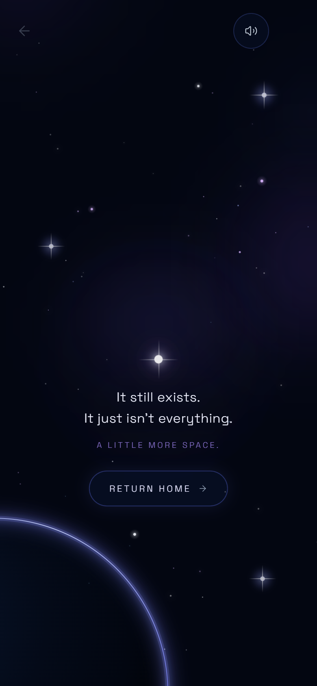<br/>
        <sub><b>06 · Completion</b><br/>Gentle perspective & return</sub>
      </td>
    </tr>
  </table>
</div>

### Desktop Cosmic Environment

<div align="center">
  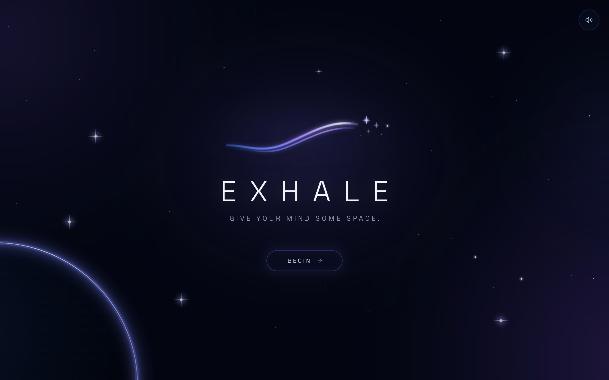
  <p align="center"><sub><b>Full Desktop View:</b> Cinematic canvas starfield with planetary limb horizon and Space Grotesk typography.</sub></p>
</div>

---

## ⚡ Verified Feature Set

- [x] **Thought-Centered Interaction:** Single-focus writing interface without character counters, badges, or distractions.
- [x] **Multi-Tier Procedural Canvas Starfield:** High-performance HTML5 Canvas rendering hundreds of stars categorized into deep background (75%), midground (20%), and foreground luminous accents (5%) with soft cross-flares.
- [x] **Dynamic Cosmos Expansion:** Procedural star density and opacity scale dynamically as the camera pulls back, visually communicating that the universe around the thought has expanded.
- [x] **Zero Text/Star Overlap:** Precise mathematical coordinate zoning guarantees that the starlight point remains cleanly positioned above perspective typography.
- [x] **Ambient Audio Choreography:** Integrated soundtrack (`Meanwhile.mp3`) with an automated 5-second cinematic fade-in curve, continuous playback across stages, and gentle fade-out at completion.
- [x] **Accessibility & Reduced Motion:** Built-in `usePrefersReducedMotion` hook automatically disables spatial drift and heavy scale transforms for users sensitive to motion.
- [x] **Offline-First PWA:** Production Service Worker with Cache-First bundle caching, Network-First shell updates, and native RFC 7233 audio pass-through streaming.
- [x] **Mobile Native Architecture:** Fully configured Capacitor 8 platform for Android, featuring edge-to-edge status bar styling and hardware back button handling.
- [x] **Complete Privacy Guarantee:** 100% ephemeral in-memory state. Thoughts disappear forever upon navigation or page close.

---

## 🏛 System Architecture

The EXHALE codebase is structured around a central application shell, a finite journey state machine, a multi-layer canvas graphics engine, and a decoupled audio management subsystem:

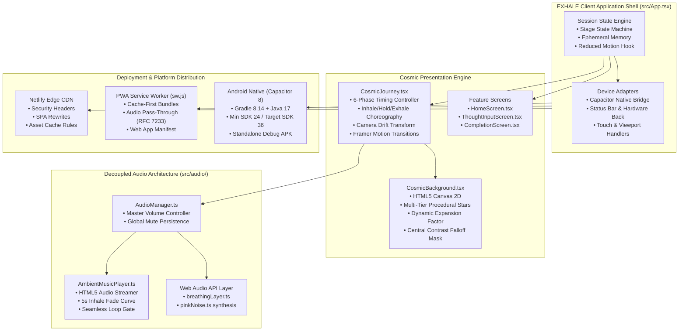

### Module Responsibilities

| Directory / File | Type | Architectural Responsibility |
|:---|:---:|:---|
| [`src/App.tsx`](file:///C:/Users/mayan/Projects/EXHALE/src/App.tsx) | Root Shell | Orchestrates top-level navigation, stage persistence, Capacitor bridge, and motion preferences. |
| [`src/components/features/journey/CosmicJourney.tsx`](file:///C:/Users/mayan/Projects/EXHALE/src/components/features/journey/CosmicJourney.tsx) | Journey Engine | Governs the timing sequence across Breathing, Camera Drift, Star Transformation, and Perspective Reveal. |
| [`src/components/features/cosmos/CosmicBackground.tsx`](file:///C:/Users/mayan/Projects/EXHALE/src/components/features/cosmos/CosmicBackground.tsx) | Canvas Engine | Procedural starfield generation, Retina DPI scaling, nebula glow layers, and dynamic cosmic expansion. |
| [`src/components/features/branding/ExhaleLogo.tsx`](file:///C:/Users/mayan/Projects/EXHALE/src/components/features/branding/ExhaleLogo.tsx) | Brand Identity | Official S-wave gradient ribbon vector graphic with dispersing 4-point celestial stars. |
| [`src/audio/ambientMusic.ts`](file:///C:/Users/mayan/Projects/EXHALE/src/audio/ambientMusic.ts) | Audio Subsystem | Singleton HTMLAudioElement lifecycle, volume ramping, and non-blocking playback management. |
| [`public/sw.js`](file:///C:/Users/mayan/Projects/EXHALE/public/sw.js) | Service Worker | Offline asset precaching, cache-first resource delivery, and direct streaming bypass for MP3 audio. |
| [`capacitor.config.ts`](file:///C:/Users/mayan/Projects/EXHALE/capacitor.config.ts) | Native Config | Configures Android package identifier (`com.exhale.cosmic`), web asset directory (`dist`), and native runtime. |

---

## 🛠 Technology Stack

EXHALE is built entirely with modern, lightweight web technologies selected for smooth 60fps rendering, low latency, and zero bloat:

| Layer | Technology | Version | Purpose in Codebase |
|:---|:---|:---:|:---|
| **Core Framework** | [React](https://react.dev/) | `^18.3.1` | Component-driven UI and lifecycle management |
| **Language** | [TypeScript](https://www.typescriptlang.org/) | `^5.7.2` | Strict type safety across all interfaces and journey states |
| **Build Tool** | [Vite](https://vitejs.dev/) | `^6.0.3` | Instant HMR development server and optimized rollup bundler |
| **Animation Engine** | [Framer Motion](https://www.framer.com/motion/) | `^11.15.0` | Declarative UI transitions, presence tracking, and spring physics |
| **Graphics Engine** | HTML5 Canvas 2D | Native | High-performance procedural starfield and cosmic expansion |
| **Audio Pipeline** | Web Audio API / HTML5 Audio | Native | Multi-channel soundscape, synthesized pink noise, and soundtrack streaming |
| **Styling** | [Tailwind CSS](https://tailwindcss.com/) | `^3.4.17` | Utility-first responsive layout and design token architecture |
| **Typography** | Space Grotesk | Google Fonts | Primary geometric sans-serif typeface matching cosmic visual identity |
| **Iconography** | [Lucide React](https://lucide.dev/) | `^0.468.0` | Minimalist iconography for sound toggle and navigation controls |
| **Native Bridge** | [Capacitor](https://capacitorjs.com/) | `^8.5.2` | Android native runtime, hardware back buttons, and status bar |
| **PWA Service Worker** | Custom Cache API Script | Native | Complete offline caching and zero-latency shell delivery |
| **Hosting Platform** | [Netlify](https://www.netlify.com/) | Global CDN | Production web hosting with security headers and cache policies |

---

## 🚀 Getting Started

Follow these steps to set up and run EXHALE locally on your workstation.

### Prerequisites

- **Node.js:** `>= 18.0.0`
- **npm:** `>= 9.0.0`
- *(Optional for Android APK):* JDK 17 & Android SDK Platform 34-36

### Installation

```bash
# 1. Clone the repository
git clone https://github.com/mayankyenugwar1/EXHALE.git
cd EXHALE

# 2. Install dependencies
npm install

# 3. Start local development server
npm run dev
```

The application will be running locally at `http://localhost:5173`.

### Production Build & Preview

```bash
# Type-check with tsc and compile optimized production bundles
npm run build

# Preview the local production build
npm run preview
```

### Android Native Environment (Capacitor)

```bash
# 1. Sync compiled web assets with Android platform
npm run cap:sync

# 2. Open Android project in Android Studio
npm run cap:open

# 3. Or compile debug APK via command line
cd android
.\gradlew.bat assembleDebug
```

---

## 🌐 Deployment & Releases

### Live Web Application
* **Production URL:** [https://exhale-cosmic.netlify.app](https://exhale-cosmic.netlify.app)
* **Status:** Operational & Live
* **Platform:** Netlify Edge Network
* **Configuration:** Clean SPA routing, automated gzip/brotli compression, Content-Security-Policy, and cache headers defined in [`netlify.toml`](file:///C:/Users/mayan/Projects/EXHALE/netlify.toml).

### Android Native Application
* **Package Identifier:** `com.exhale.cosmic`
* **Local Build Status:** Successfully compiled debug APK
* **Binary Location:** `android/app/build/outputs/apk/debug/app-debug.apk`
* **Binary Size:** 16.97 MB (includes full 13 MB offline ambient soundtrack bundle)
* *Note: The Android application has been compiled locally for testing and direct sideloading. It is not currently published on the Google Play Store.*

---

## 📂 Project Structure

```
EXHALE/
├── android/                   # Capacitor 8 Android native wrapper project
│   ├── app/                   # Android application module & Gradle build scripts
│   │   └── build/outputs/apk/ # Local compiled APK binaries
│   └── build.gradle           # Root Gradle build script (Java 17 compatibility)
├── docs/                      # Documentation and presentation assets
│   └── assets/                # README banners, animations, and screenshots
│       ├── exhale-banner.svg  # Vector brand header with S-wave ribbon
│       ├── hero-cosmic.gif    # Animated cosmic breathing visual
│       └── screenshots/       # Verified app captures across all 6 stages
├── public/                    # Static public assets served by Vite
│   ├── audio/                 # Ambient soundtrack (Meanwhile.mp3)
│   ├── icon-192.png / .svg    # PWA application icons
│   ├── icon-512.png / .svg    # High-resolution splash & maskable icons
│   ├── manifest.json          # Web App Manifest specification
│   ├── sw.js                  # Production Service Worker (Cache API)
│   └── _redirects             # Netlify SPA redirect routing rule
├── src/                       # Application source code
│   ├── audio/                 # Audio engine (AudioManager, AmbientMusicPlayer)
│   ├── components/
│   │   ├── features/
│   │   │   ├── branding/      # ExhaleLogo vector component
│   │   │   ├── breathing/     # BreatheScreen guided timing
│   │   │   ├── completion/    # CompletionScreen perspective message
│   │   │   ├── cosmos/        # CosmicBackground HTML5 Canvas starfield
│   │   │   ├── drift/         # DriftScreen spatial camera pull-back
│   │   │   ├── home/          # HomeScreen cosmic entrance portal
│   │   │   ├── journey/       # CosmicJourney state machine & choreography
│   │   │   └── thought/       # ThoughtInputScreen reflective input
│   │   └── ui/                # Core UI primitives (Button, SoundToggle)
│   ├── hooks/                 # Custom React hooks (usePrefersReducedMotion)
│   ├── styles/                # Tailwind CSS layers and design tokens
│   ├── types/                 # Shared TypeScript interfaces & stage enums
│   ├── App.tsx                # Master application root shell
│   └── main.tsx               # React DOM entry point
├── capacitor.config.ts        # Capacitor configuration
├── netlify.toml               # Netlify hosting and security headers
├── package.json               # NPM scripts and dependency manifests
├── tailwind.config.js         # Tailwind theme customizations
└── vite.config.ts             # Vite configuration with React plugin
```

---

## 🧭 Design Philosophy

EXHALE was deliberately constructed according to five grounding design tenets:

1. **The User's Thought is the Hero:** The interface never gets in the way of what you wrote. The thought is not filed away into a list or evaluated; it is held as the central celestial body.
2. **Space Over Speed:** Contemporary apps optimize for high engagement and dopamine clicks. EXHALE is designed to be slow, quiet, and calming—giving your nervous system time to settle.
3. **Perspective Instead of Fixing:** When we are anxious, thoughts feel all-consuming. EXHALE does not offer advice or toxic positivity; it simply pulls the camera back until the thought is seen in its natural proportion within a vast universe.
4. **Zero Gamification:** There are no streaks, experience points, notifications, accounts, or reminder bells. You open EXHALE when you need space, and leave when you are ready.
5. **Absolute Privacy:** What you write is sacred. EXHALE does not log, store, or transmit your thoughts to any server. When the browser closes, the thought is gone.

---

## 🗺 Roadmap

### Completed Capabilities
- [x] Full 6-stage cosmic journey choreography (Thought → Breath → Drift → Star → Perspective → Release).
- [x] Multi-tier procedural HTML5 Canvas starfield with dynamic cosmic expansion factor.
- [x] Ambient audio player with automated 5-second fade-in and smooth muting transitions.
- [x] Offline-first Progressive Web App (PWA) with Service Worker precaching and RFC 7233 audio pass-through.
- [x] Fully responsive layout tested across micro, standard, and large mobile viewports (320px–430px) and desktop.
- [x] Capacitor 8 Android native wrapper with verified debug APK generation (`app-debug.apk`).
- [x] Global CDN deployment on Netlify with automated build workflows.

### Future Horizons
- [ ] Google Play Store release candidate build and signing configuration.
- [ ] iOS platform target configuration with Capacitor iOS runtime.
- [ ] Alternative guided breathing modes (e.g., 4-7-8 breathing, Box breathing).
- [ ] User-selectable ambient cosmic soundscapes (e.g., Solar Wind, Deep Space Resonance).

---

## 🤝 Contributing

Contributions that align with the minimalist aesthetic and calm philosophy of EXHALE are welcome.

1. Fork the Project
2. Create your Feature Branch (`git checkout -b feature/CosmicFeature`)
3. Commit your Changes (`git commit -m 'Add subtle celestial accent'`)
4. Push to the Branch (`git push origin feature/CosmicFeature`)
5. Open a Pull Request

*Please ensure all changes maintain zero dependencies on external tracking and preserve strict TypeScript zero-error compilation (`npm run build`).*

---

## 📄 License

*No license has been specified yet.*

---

<div align="center">
  <sub>EXHALE — Give your mind some space.</sub><br/>
  <sub>Crafted with care for calm minds.</sub>
</div>
